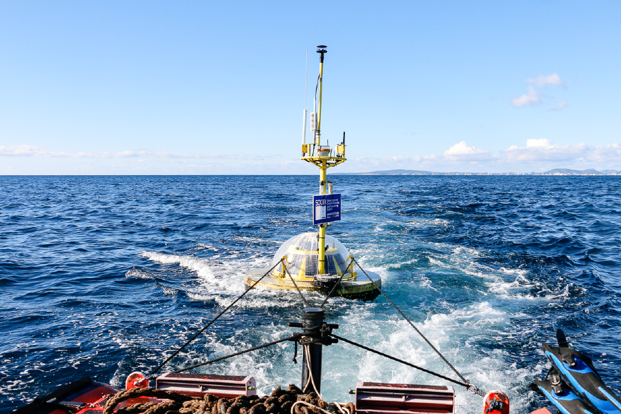

# What are SOCIB data-sources?

SOCIB data-sources corresponds to the so-called 'deployments'. In oceanography, 'deployments' are instrument&platform enssemble deployed (placed or released) to retrieve data from the ocean. 

For example, see here the deployment of a platform (an Ocenographic buoy) with all its instruments: wave recorder, weather station, conductivity and temperature recorder, currentemeter, current profiler ...
  

During the time period a given deployment (unique instrument&platform enssemble) is active, the data measured by it is said to belong together and it is stored in the same netCDF to be later distributed in THREDDS. SOCIB API data-source endpoint allows a quick access to the data collected by a deployment.

See here how to use it:

- What is a data-source? ([Example 1](what_is_a_data_source.ipynb))

- Searching for certain data-sources ([Example 2](searching_for_certain_data_sources.ipynb)) by coverage_bounding_box, type, status, instrument, platform, initial_time, end_time, processing levels etc.

- Requesting a data-source's data ([Example 3](requesting_a_data_sources_data.ipynb))

- Subsetting a data-source's data ([Example 4](subsetting_a_data_sources_data.ipynb))

- Resampling a data-source's data ([Example 5](resampling_a_data_sources_data.ipynb))

# Who is addressed to?

Anyone interested in exploring SOCIB data archiving can use the API, that is, researchers for finding the data that better suit their study-cases or developers interested in integrating SOCIB data on its products.  